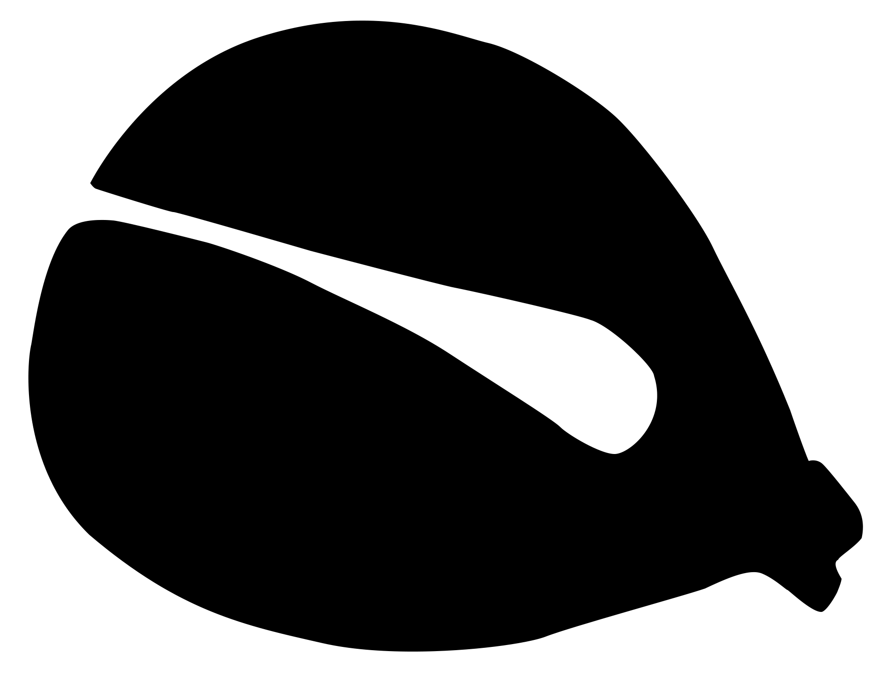
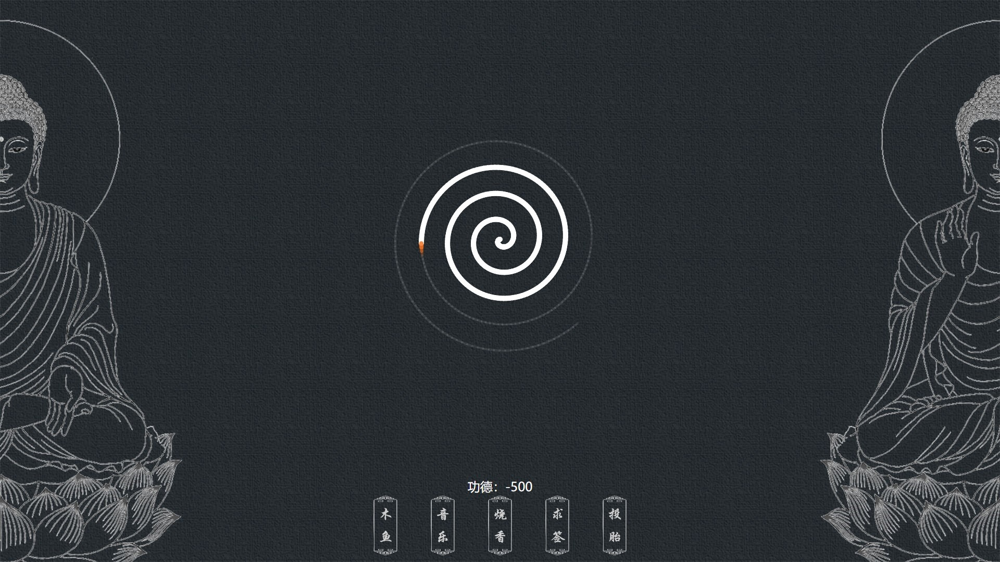

<p align="center">
	<a href="https://github.com/xiwang-online/People-Detection-System">
		<br />
		<b>Electronic Wooden Fish</b>
	</a><br />
	<br />
	<b>电子木鱼WEB版</b><br />
	<b>电子木鱼|大悲咒|烧香|求签|投胎</b>
</p>
<p align="center">

</p>


## 简介
有一次在网上看到电子木鱼这个创意，感觉很有意思就也想做一个，开始做的时候电子木鱼其实还没火起来，但是我因为同时还在做其他项目，这个只是业余做着玩玩，所以就做的很慢，没等我做好，电子木鱼就已经火遍全网了，等我做好了，电子木鱼都已经过时了。  
这是个纯前端的项目，除了可以手动或自动的敲木鱼，还加入了背景音乐、烧香、求签、投胎等玩法，还是挺有意思的，我自己就经常求个签看看接下来的运势怎么样。  
目前还只支持桌面端，移动端的适配一直没做，等以后有空再说吧。  


## 效果演示
[在线试玩](https://muyu.xiwang.online/#/)


## 项目运行
1. 进入Vue文件夹
2. 在项目目录运行命令下载并安装包文件：```cnpm install```
3. 运行：```npm run dev```

## 项目截图
<p align="center">

</p>
<p align="center">

</p>
<p align="center">

</p>
